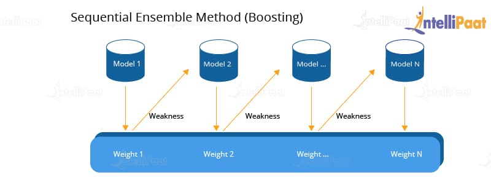
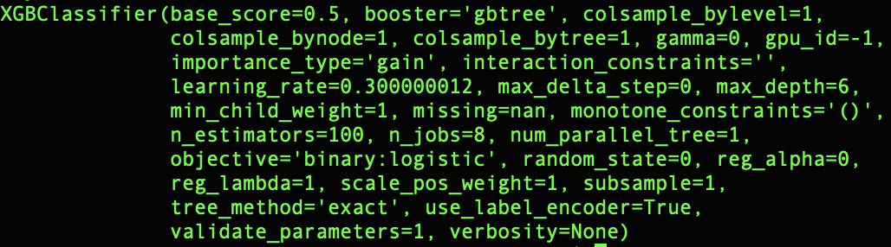

# XGBoost Machine Learning prediction
Approaching ML Multiple Learners: Boosting (XGboost)

## General Description
Multiple Learners are a different and interesting alternative respect to classic state of art algorithm in Machine Learning. The idea is the following: instead to train a complex learner/model called committees (set of model trained on Dataset), train many different learners and then combine their results; this can lead to achieve better results in predictions (Ensemble Methods).

In this case we have the Boosting Technique (model trained in "parallel" on the same dataset) with the aim to reduce the variance in the prediction error.

output: Ym(x) = sign( Σαm Ym(x) )

## XGBoost approach
XGBoost is an implementation of gradient boosted decision trees designed for speed and performance that is dominative competitive machine learning. It employs a number of eye-catching tricks that make it exceptionally effective, particularly with structured data.

It is characterized by several steps:
Step 1: Execute a prediction
Step 2: Calculate the residuals
Step 3: Create an XGBoost tree by calculating a similarity score
Step 4: Define a pruning technique
Step 5: Calculate the output value for each leaf
Step 6: Calculate the new residuals
Step 7: Repeat steps 3 to 6 until the number of iterations matches the number specified by the parameter (i.e. the number of estimators)
Step 8: make the final prediction 

## Problem
In this work I wrote a simple python script in which the XGBoost approach is implemented.
We are going to use the Pima Indians onset of diabetes dataset. This dataset is comprised of 8 input variables that describe medical details of patients and one output variable to indicate whether the patient will have an onset of diabetes within 5 years. This is a good dataset for a first XGBoost model because all of the input variables are numeric and the problem is a simple binary classification problem. It is not necessarily a good problem for the XGBoost algorithm because it is a relatively small dataset and an easy problem to model.

## Model and accuracy result
The model parameters are showed following

The final accuracy is good: 0.7 so the model has learned well.

## References

